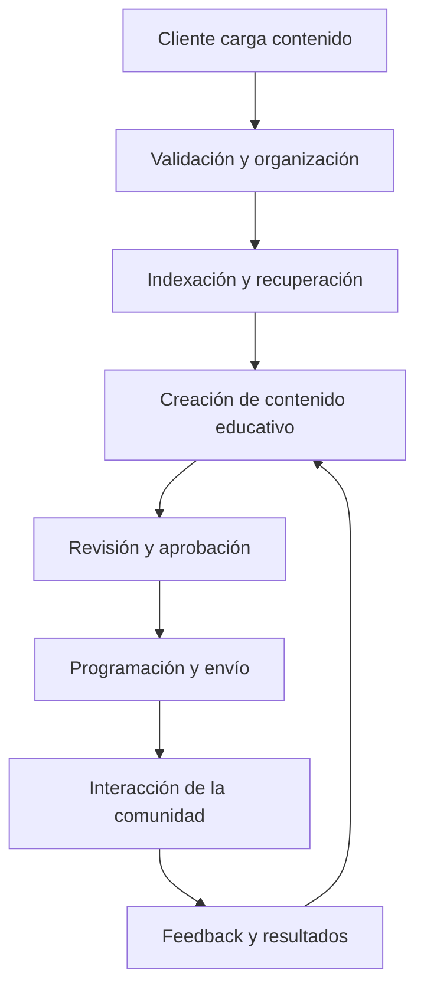

# AutoAprendizaje — Documento de kick-off

**Versión:** 0.1  
**Estado:** Borrador inicial para validación  
**Fecha de elaboración:** 22 de septiembre de 2026  
**Autor:** Pendiente por definir  
**Patrocinador:** Pendiente por definir  
**Director del proyecto:** Pendiente por definir

> Este documento distingue entre información confirmada, propuestas para discusión y datos pendientes. Ninguna propuesta se considera una decisión aprobada hasta que quede validada por el equipo del proyecto.

## 1. Propósito del kick-off

Iniciar formalmente AutoAprendizaje, alinear al equipo sobre el problema que se busca abordar, acordar una visión común del producto y definir la información que debe levantarse antes de aprobar el alcance, la arquitectura, el cronograma y el presupuesto.

## 2. Contexto confirmado

AutoAprendizaje busca educar comunidades mediante mensajería directa. El primer canal contemplado es WhatsApp.

El flujo general comunicado hasta el momento es:

1. Un cliente carga contenido destinado a su comunidad.
2. La plataforma indexa el contenido.
3. La plataforma crea contenido a partir del material cargado.
4. La plataforma distribuye el contenido a las personas que deben consumirlo.
5. La plataforma obtiene o genera retroalimentación sobre el contenido enviado.

## 3. Visión inicial del producto

### 3.1 Enunciado de visión

Construir una plataforma que permita convertir contenido aportado por un cliente en experiencias educativas distribuidas a su comunidad mediante mensajería directa, inicialmente WhatsApp, e incorporar un ciclo de retroalimentación que permita conocer la interacción con el contenido.

### 3.2 Propuesta de valor

**Estado:** Propuesta para validación.

Facilitar a organizaciones o responsables de comunidades la preparación, entrega y seguimiento de contenido educativo sin exigir que los participantes abandonen el canal de mensajería definido para la experiencia.

### 3.3 Actores iniciales

| Actor | Descripción confirmada | Información pendiente |
|---|---|---|
| Cliente | Carga contenido para una comunidad. | Tipo de organización, permisos, número de administradores y modelo de contratación. |
| Comunidad | Personas que requieren consumir el contenido. | Perfil, tamaño, ubicación, edades, necesidades de accesibilidad y forma de vinculación. |
| Equipo del proyecto | Diseña, construye, valida y opera la solución. | Personas asignadas, dedicación y estructura de gobierno. |
| Patrocinador | No informado. | Nombre, autoridad, presupuesto y criterios de éxito. |

### 3.4 Referente aportado

Se recibió como referencia [HackÜ](https://www.hacku.com/). Su sitio público presenta capacidades relacionadas con capacitación y microaprendizaje a través de WhatsApp y otros canales, carga de varios formatos, medición, asistentes de IA, pruebas y gamificación.

**Uso acordado para esta versión:** tratarlo únicamente como referente de mercado para formular preguntas y comparar capacidades. No se incorpora ninguna de sus funciones al alcance de AutoAprendizaje sin una decisión expresa.

Durante el kick-off deberá definirse:

- qué problema resolverá AutoAprendizaje de manera diferenciada;
- qué capacidades del referente son relevantes, innecesarias o deben investigarse;
- si se realizará un análisis competitivo formal y bajo qué criterios;
- qué evidencia respaldará la diferenciación propuesta.

## 4. Flujo funcional refinado

El siguiente flujo es una **propuesta de descomposición funcional** basada exclusivamente en el esquema inicial. Debe validarse durante el descubrimiento.

### 4.1 Capacidades que deben discutirse

| Etapa | Capacidad propuesta | Decisiones pendientes |
|---|---|---|
| Incorporación del cliente | Crear y administrar el espacio de cada cliente. | Modelo de acceso, roles, aislamiento de datos y proceso de alta. |
| Carga de fuentes | Recibir y organizar el contenido fuente. | Formatos, tamaños, idiomas, derechos de uso, metadatos y control de versiones. |
| Procesamiento | Extraer, clasificar e indexar el contenido. | Tecnologías, criterios de calidad, trazabilidad y tratamiento de errores. |
| Creación educativa | Transformar las fuentes en piezas o secuencias aptas para mensajería. | Tipos de contenido, nivel de automatización, tono, duración y reglas pedagógicas. |
| Validación | Permitir revisión antes de publicar. | Si será obligatoria, quién aprueba y cómo se conserva la evidencia. |
| Segmentación | Determinar quién recibe cada contenido. | Datos de audiencia, reglas, consentimiento y personalización. |
| Distribución | Programar y enviar contenido por WhatsApp. | Proveedor, plantillas, ventanas de contacto, límites y manejo de fallos. |
| Interacción | Recibir respuestas o acciones de los participantes. | Tipos de interacción: confirmaciones, preguntas, actividades, evaluaciones u otros. |
| Feedback | Recopilar y presentar información sobre el contenido lanzado. | Definición de feedback, indicadores, reportes y uso para ajustes posteriores. |
| Gobierno | Administrar seguridad, privacidad, auditoría y operación. | Regulación aplicable, retención, soporte, monitoreo y responsables. |

## 5. Objetivos del kick-off

1. Validar el problema, la población beneficiaria y la oportunidad.
2. Acordar la terminología principal: cliente, comunidad, contenido, campaña, aprendizaje y feedback.
3. Validar el flujo funcional inicial y señalar sus excepciones.
4. Identificar el producto mínimo viable (MVP) sin asumir todavía sus funcionalidades definitivas.
5. Identificar fuentes de contenido, tipos de usuarios, datos tratados e integraciones necesarias.
6. Acordar responsables para resolver los pendientes del PID.
7. Definir el proceso para aprobar alcance, arquitectura, cronograma, presupuesto y criterios de éxito.

## 6. Agenda propuesta

**Duración:** Pendiente por definir.

| Bloque | Tema | Resultado esperado |
|---|---|---|
| 1 | Presentación y propósito | Participantes y autoridad de decisión identificados. |
| 2 | Problema y comunidad objetivo | Problema validado y usuarios descritos. |
| 3 | Recorrido del flujo | Etapas, entradas, salidas y excepciones identificadas. |
| 4 | Contenido y experiencia educativa | Fuentes, formatos, reglas y necesidad de aprobación registradas. |
| 5 | WhatsApp y operación | Requisitos del canal, consentimiento y soporte identificados. |
| 6 | Datos, IA, seguridad y cumplimiento | Categorías de datos y decisiones de gobierno por investigar. |
| 7 | MVP y medición | Hipótesis de alcance e indicadores para validar. |
| 8 | Organización del proyecto | Responsables, próximos entregables y fechas por acordar. |

## 7. Preguntas que deben resolverse

### 7.1 Problema y usuarios

- ¿Qué problema educativo concreto se busca resolver primero?
- ¿Quién contrata o administra la plataforma?
- ¿Quiénes conforman la primera comunidad objetivo?
- ¿Qué barreras actuales existen para que esa comunidad acceda, consuma o comprenda el contenido?
- ¿Qué significa “educar” en el primer caso de uso: informar, capacitar, evaluar, certificar u otro resultado?

### 7.2 Contenido

- ¿Qué formatos podrá cargar el cliente?
- ¿Quién es propietario del contenido y quién autoriza su transformación y distribución?
- ¿En qué idiomas se encuentra el contenido fuente y en cuáles debe publicarse?
- ¿La plataforma resumirá, adaptará, evaluará, secuenciará o generará material nuevo?
- ¿Qué contenidos requieren revisión humana antes del envío?
- ¿Cómo se validará que el material generado permanezca fiel a las fuentes?

### 7.3 Comunidad y mensajería

- ¿Cómo se registran y segmentan los participantes?
- ¿Cómo se obtiene, almacena y revoca el consentimiento para recibir mensajes?
- ¿La interacción será individual, grupal o ambas?
- ¿Qué tipos de mensajes se contemplan: texto, audio, imagen, video, documento, enlace u otros?
- ¿Quién atiende preguntas que la plataforma no pueda resolver?
- ¿Qué debe ocurrir ante mensajes no entregados, usuarios inactivos o solicitudes de retiro?

### 7.4 Aprendizaje y feedback

- ¿Qué se entiende por “feedback”: reacción, respuesta abierta, evaluación, avance, satisfacción u otra señal?
- ¿Qué indicadores evidenciarán consumo, comprensión o aplicación?
- ¿Habrá rutas adaptativas según las respuestas de cada persona?
- ¿Quién consulta los resultados y qué decisiones debe poder tomar con ellos?
- ¿Se requiere historial individual o solo información agregada?

### 7.5 Tecnología, datos e IA

- ¿Qué componentes utilizarán inteligencia artificial y cuáles seguirán reglas determinísticas?
- ¿Qué proveedores, modelos o infraestructura están autorizados?
- ¿Qué datos personales o sensibles podrían procesarse?
- ¿En qué países operará inicialmente el producto?
- ¿Qué requisitos legales, contractuales, de privacidad, seguridad, retención y auditoría aplican?
- ¿Qué niveles de disponibilidad, rendimiento, escalabilidad y recuperación se requieren?

### 7.6 Proyecto y negocio

- ¿Quién patrocina, dirige y aprueba el proyecto?
- ¿Existe una fecha objetivo o compromiso externo?
- ¿Cuál es el presupuesto disponible y cómo se aprobará?
- ¿Cuál será el modelo comercial?
- ¿Qué condiciones deben cumplirse para autorizar un piloto y posteriormente producción?

## 8. Roles iniciales

Las responsabilidades siguientes son una **propuesta para discusión**. Las personas, dedicaciones y autoridades están pendientes.

| Rol | Responsabilidad propuesta durante el proyecto |
|---|---|
| AI Architect | Diseñar la arquitectura objetivo; definir límites, integraciones, atributos de calidad, decisiones técnicas y gobierno de componentes de IA. |
| AI Developer | Implementar funcionalidades, integraciones, flujos de datos y componentes de aplicación definidos para el producto. |
| AI Engineer | Diseñar y evaluar los procesos de ingestión, recuperación, generación, observabilidad y mejora de las capacidades de IA. |
| Testing QA | Definir la estrategia de pruebas y verificar funcionalidad, integraciones, calidad de resultados de IA, seguridad y criterios de aceptación. |
| Project Designer | Diseñar la experiencia del cliente y de la comunidad, los flujos de interacción y las interfaces necesarias. El nombre y los límites de este rol deben validarse. |
| Patrocinador | Pendiente por identificar y definir. |
| Director del proyecto | Pendiente por identificar y definir. |
| Experto pedagógico o de contenido | Participación pendiente de decidir. |
| Responsable legal, privacidad y seguridad | Participación pendiente de decidir. |
| Responsable de producto | Participación pendiente de decidir. |

## 9. Acuerdos que deberían salir de la sesión

- Problema y primer caso de uso aceptados o devueltos para ajuste.
- Comunidad inicial identificada.
- Flujo funcional inicial validado.
- Hipótesis de MVP documentada.
- Lista de decisiones y preguntas abiertas priorizada.
- Propietario y fecha objetivo para cada pendiente.
- Próxima instancia de revisión definida.

## 10. Registro de decisiones y pendientes

| ID | Tema | Estado inicial | Responsable | Fecha objetivo |
|---|---|---|---|---|
| D-01 | Nombre definitivo del producto | Pendiente | Pendiente | Pendiente |
| D-02 | Problema y caso de uso inicial | Pendiente | Pendiente | Pendiente |
| D-03 | Definición del MVP | Pendiente | Pendiente | Pendiente |
| D-04 | Proveedor e integración de WhatsApp | Pendiente | Pendiente | Pendiente |
| D-05 | Definición de feedback e indicadores | Pendiente | Pendiente | Pendiente |
| D-06 | Arquitectura y proveedores de IA | Pendiente | Pendiente | Pendiente |
| D-07 | Marco de privacidad, seguridad y cumplimiento | Pendiente | Pendiente | Pendiente |
| D-08 | Cronograma y presupuesto | Pendiente | Pendiente | Pendiente |
| D-09 | Director, patrocinador y responsables | Pendiente | Pendiente | Pendiente |
| D-10 | Alcance y criterios del benchmark frente a HackÜ | Pendiente | Pendiente | Pendiente |

## 11. Próximos pasos propuestos

1. Realizar el kick-off con los responsables de negocio, producto, tecnología y contenido.
2. Completar el registro de decisiones y pendientes.
3. Definir el primer caso de uso y la comunidad piloto.
4. Elaborar el inventario de contenido, datos e integraciones.
5. Delimitar el MVP y sus criterios de aceptación.
6. Actualizar y someter a aprobación el PID.
