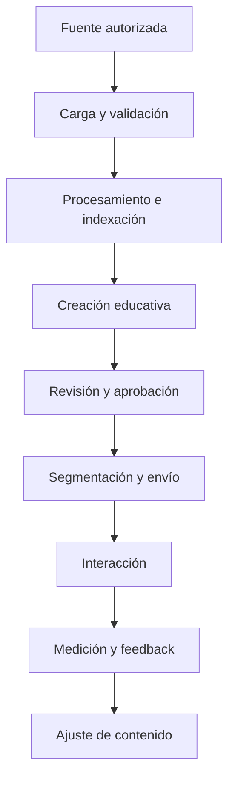

# AutoAprendizaje — Project Initiation Document (PID)

**Versión:** 0.1  
**Estado:** Borrador inicial; no aprobado  
**Fecha de elaboración:** 22 de septiembre de 2026  
**Autor:** Pendiente por definir  
**Patrocinador:** Pendiente por definir  
**Director del proyecto:** Pendiente por definir

> Los elementos marcados como “Propuesta para validación” no representan decisiones aprobadas. Cuando la información no ha sido suministrada, se conserva expresamente como “Pendiente por definir”.

## 1. Información general

| Campo | Información disponible |
|---|---|
| Nombre inicial | AutoAprendizaje |
| Nombre definitivo | Pendiente por definir |
| Fecha del documento | 22 de septiembre de 2026 |
| Autor | Pendiente por definir |
| Patrocinador | Pendiente por definir |
| Director del proyecto | Pendiente por definir |
| Organización responsable | Pendiente por definir |
| Estado | Inicio / definición preliminar |
| Canal inicial | WhatsApp |
| Comunidades o clientes iniciales | Pendiente por definir |

## 2. Resumen ejecutivo

AutoAprendizaje es una iniciativa para educar comunidades mediante mensajería directa. En su planteamiento inicial, un cliente carga contenido; la plataforma lo indexa, crea contenido derivado, lo distribuye a las personas que requieren consumirlo y obtiene o produce feedback sobre el material enviado.

Esta versión del PID organiza la información disponible y define los asuntos que deben resolverse antes de aprobar una línea base de alcance, tiempo, costo y calidad. No establece fechas, cifras, tecnologías ni compromisos no suministrados.

## 3. Antecedentes y justificación

### 3.1 Antecedente confirmado

Se ha identificado la intención de utilizar mensajería directa, inicialmente WhatsApp, como medio para entregar contenido educativo a comunidades.

### 3.2 Problema u oportunidad

**Pendiente por definir con evidencia del primer caso de uso.**

La formulación deberá especificar:

- quién presenta el problema;
- cuál es la situación actual;
- qué limitaciones tiene el proceso actual;
- a quién afecta y en qué magnitud;
- qué evidencia demuestra la necesidad;
- qué resultado se espera obtener mediante el proyecto.

### 3.3 Justificación

**Pendiente por definir.** No se han proporcionado todavía datos sobre demanda, impacto educativo, ahorro, alcance, beneficio social, ingresos, obligaciones contractuales u otros fundamentos que permitan justificar la inversión.

### 3.4 Hipótesis de valor

**Propuesta para validación:** si el contenido educativo puede prepararse, distribuirse y evaluarse dentro de un canal de mensajería utilizado por la comunidad, entonces podría facilitarse su acceso y seguimiento. Esta hipótesis deberá probarse mediante indicadores acordados; no se considera demostrada en este PID.

### 3.5 Referente aportado

El material recibido identifica a [HackÜ](https://www.hacku.com/) como referencia. En su sitio público, HackÜ presenta una oferta de capacitación y comunicación mediante WhatsApp y otros canales, carga de contenido en diversos formatos, métricas, microaprendizaje, asistentes de IA, actividades de validación y gamificación.

Esta información se registra únicamente como **insumo de benchmark**. No demuestra una necesidad de AutoAprendizaje ni incorpora automáticamente esas capacidades al producto. Quedan pendientes un análisis competitivo verificable, sus criterios de comparación y la definición de la diferenciación buscada.

## 4. Objetivos

### 4.1 Objetivo general

Diseñar y desarrollar una plataforma para gestionar un ciclo de contenido educativo dirigido a comunidades mediante mensajería directa, inicialmente WhatsApp, que abarque carga, indexación, creación, distribución y feedback.

### 4.2 Objetivos específicos iniciales

1. Permitir que un cliente incorpore y organice el contenido fuente autorizado para su comunidad.
2. Procesar e indexar el contenido para facilitar su recuperación y uso dentro de los flujos aprobados.
3. Crear contenido educativo derivado del material fuente bajo criterios que deberán definirse y validarse.
4. Incorporar un mecanismo de revisión y aprobación antes de distribuir contenido, si esta necesidad se confirma.
5. Entregar el contenido a destinatarios autorizados mediante WhatsApp en el alcance inicial.
6. Recopilar interacciones o feedback y presentarlos de forma útil para los responsables del cliente.
7. Mantener trazabilidad entre las fuentes, el contenido creado, los envíos y los resultados, sujeto a los requisitos de retención y privacidad que se definan.
8. Evaluar el producto mediante criterios de éxito acordados antes de ampliar el alcance.

### 4.3 Indicadores y metas

**Pendientes por definir.** No se fijan porcentajes ni volúmenes sin una línea base.

| Dimensión | Indicador por definir | Línea base | Meta | Método de medición |
|---|---|---|---|---|
| Adopción | Clientes y comunidades activas | Pendiente | Pendiente | Pendiente |
| Alcance | Participantes autorizados y mensajes entregados | Pendiente | Pendiente | Pendiente |
| Interacción | Participación frente al contenido enviado | Pendiente | Pendiente | Pendiente |
| Aprendizaje | Medida de comprensión o aplicación | Pendiente | Pendiente | Pendiente |
| Calidad de contenido | Aprobación, correcciones y fidelidad a fuentes | Pendiente | Pendiente | Pendiente |
| Operación | Entregas, errores, tiempos de respuesta y disponibilidad | Pendiente | Pendiente | Pendiente |
| Satisfacción | Evaluación de clientes y participantes | Pendiente | Pendiente | Pendiente |

## 5. Alcance

### 5.1 Alcance funcional inicial confirmado

- Carga de contenido por parte de un cliente.
- Indexación del contenido cargado.
- Creación de contenido por parte de la plataforma.
- Distribución del contenido a las personas que requieren consumirlo.
- Feedback relacionado con el contenido lanzado.
- Uso inicial de WhatsApp como canal de mensajería directa.

### 5.2 Alcance funcional propuesto para evaluación

Los siguientes componentes explicitan capacidades necesarias o posibles, pero **no están aprobados**:

1. Administración de clientes, usuarios, comunidades y permisos.
2. Validación de archivos, extracción de información, metadatos y versionado de fuentes.
3. Búsqueda y recuperación de fragmentos relevantes desde el contenido indexado.
4. Configuración de objetivos, audiencia, tono, formato, secuencia y calendario de contenido.
5. Generación asistida por IA con referencias a las fuentes empleadas.
6. Revisión, edición y aprobación humana antes de publicar.
7. Segmentación y personalización de destinatarios.
8. Programación, envío, reintento y registro de entregas por WhatsApp.
9. Gestión de respuestas, preguntas, evaluaciones u otras interacciones.
10. Paneles o reportes de actividad y resultados.
11. Auditoría, observabilidad, manejo de incidentes y administración de consentimiento.

### 5.3 Fuera del alcance actual

No existe todavía una exclusión funcional aprobada. Para evitar interpretar silencios como decisiones, los siguientes temas quedan **fuera de compromiso en esta versión y pendientes de evaluación**:

- Canales distintos de WhatsApp.
- Certificaciones académicas.
- Creación o comercialización de cursos completos.
- Videollamadas, clases sincrónicas o comunidades grupales.
- Pagos, facturación o comercio electrónico.
- Integraciones diferentes de las necesarias para WhatsApp.
- Aplicaciones móviles nativas.
- Soporte multilingüe.
- Rutas adaptativas o tutores conversacionales.
- Analítica predictiva.

Esta lista no significa que los elementos estén descartados; significa que no han sido incorporados al alcance inicial.

## 6. Descripción del producto

### 6.1 Flujo principal

La revisión y aprobación, segmentación, medición y ajuste se muestran como una propuesta de flujo que debe validarse.

### 6.2 Entradas y salidas por etapa

| Etapa | Entrada | Salida esperada | Pendientes críticos |
|---|---|---|---|
| Carga | Contenido del cliente | Fuente registrada | Formatos, límites, propiedad y permisos. |
| Validación | Fuente registrada | Contenido aceptado o rechazado | Reglas de calidad, seguridad y error. |
| Indexación | Contenido aceptado | Índice consultable | Motor, metadatos, fragmentación y actualización. |
| Creación | Fuentes recuperadas e instrucciones | Pieza o secuencia educativa | Modelos, plantillas, pedagogía y fidelidad. |
| Aprobación | Contenido creado | Versión publicable | Roles, flujo y evidencia de aprobación. |
| Distribución | Contenido aprobado y audiencia | Mensajes procesados por el canal | Proveedor, consentimiento, plantillas y límites. |
| Interacción | Respuestas o eventos | Datos de participación | Tipos de respuesta y tratamiento de mensajes libres. |
| Feedback | Eventos e indicadores | Reporte o ajuste | Definición de éxito y responsables de decisión. |

### 6.3 Casos de uso iniciales

| ID | Caso de uso | Estado |
|---|---|---|
| CU-01 | Registrar contenido fuente de un cliente | Confirmado en nivel conceptual |
| CU-02 | Indexar contenido | Confirmado en nivel conceptual |
| CU-03 | Crear contenido derivado | Confirmado en nivel conceptual |
| CU-04 | Enviar contenido a participantes por WhatsApp | Confirmado en nivel conceptual |
| CU-05 | Obtener o generar feedback | Confirmado en nivel conceptual; definición pendiente |
| CU-06 | Revisar y aprobar contenido antes del envío | Propuesto para validación |
| CU-07 | Segmentar una comunidad | Propuesto para validación |
| CU-08 | Consultar resultados | Propuesto para validación |

## 7. Requisitos no funcionales y restricciones

No se han definido valores ni acuerdos. Las siguientes categorías deben ser especificadas:

- privacidad y protección de datos;
- seguridad, autenticación y autorización;
- aislamiento entre clientes;
- trazabilidad y auditoría;
- fidelidad del contenido creado frente a las fuentes;
- supervisión humana y gestión de errores de IA;
- rendimiento y capacidad;
- disponibilidad y continuidad;
- accesibilidad;
- retención y eliminación de datos;
- observabilidad y soporte;
- portabilidad, propiedad y ubicación de datos;
- costos máximos por cliente, participante, mensaje o generación.

### 7.1 Restricciones conocidas

| Restricción | Estado |
|---|---|
| WhatsApp es el canal inicial previsto. | Confirmada en el planteamiento inicial. |
| Normas y condiciones aplicables al uso de WhatsApp. | Deben investigarse una vez se defina el modelo de integración y los países de operación. |
| Legislación de datos aplicable. | Pendiente de países, tipos de datos y responsables del tratamiento. |
| Presupuesto, tiempo y proveedores autorizados. | Pendiente por definir. |

## 8. Entregables

### 8.1 Entregables de iniciación

| Entregable | Estado |
|---|---|
| Documento de kick-off | Borrador v0.1 |
| PID | Borrador v0.1 |
| Registro de decisiones y pendientes | Incluido inicialmente en ambos documentos |
| Mapa de actores y usuarios | Pendiente |
| Definición del problema y caso de uso piloto | Pendiente |
| Inventario de contenido, datos e integraciones | Pendiente |

### 8.2 Entregables del producto

**Pendientes de aprobación del MVP.** No es posible comprometer entregables técnicos definitivos antes de validar el alcance.

## 9. Temporalización

No se han suministrado fechas de inicio, hitos o finalización. Se propone organizar el trabajo en etapas, cuya duración y fechas deben estimarse después de precisar el MVP y los recursos.

| Etapa | Propósito | Inicio | Fin | Criterio de salida |
|---|---|---|---|---|
| 0. Iniciación | Validar problema, gobierno y PID | Pendiente | Pendiente | PID aprobado |
| 1. Descubrimiento | Definir usuarios, proceso, datos, contenido y MVP | Pendiente | Pendiente | Alcance y criterios de éxito aprobados |
| 2. Diseño | Diseñar experiencia, arquitectura y estrategia de pruebas | Pendiente | Pendiente | Diseños y decisiones técnicas aprobados |
| 3. Construcción | Implementar el MVP aprobado | Pendiente | Pendiente | Criterios de construcción cumplidos |
| 4. Validación | Ejecutar pruebas funcionales, técnicas, de IA y de usuario | Pendiente | Pendiente | Criterios de aceptación cumplidos |
| 5. Piloto | Operar con la comunidad seleccionada | Pendiente | Pendiente | Resultados del piloto evaluados |
| 6. Decisión de evolución | Ajustar, ampliar, mantener o detener | Pendiente | Pendiente | Decisión documentada |

## 10. Roles, responsabilidades y gobierno

La numeración inicial contenía dos “Role 4”. Para efectos documentales se normaliza “Designer Project” como **rol 5**, sin alterar la composición propuesta.

### 10.1 Equipo inicial propuesto

| Rol | Responsabilidades propuestas | Persona | Dedicación | Autoridad de aprobación |
|---|---|---|---|---|
| 1. AI Architect | Arquitectura, integraciones, atributos de calidad, decisiones técnicas y gobierno de IA. | Pendiente | Pendiente | Pendiente |
| 2. AI Developer | Desarrollo de aplicaciones, servicios, integraciones y flujos aprobados. | Pendiente | Pendiente | Pendiente |
| 3. AI Engineer | Ingestión, recuperación, generación, evaluación y observabilidad de componentes de IA. | Pendiente | Pendiente | Pendiente |
| 4. Testing QA | Estrategia y ejecución de pruebas, evidencia de calidad y control de criterios de aceptación. | Pendiente | Pendiente | Pendiente |
| 5. Project Designer | Experiencia de usuario, diseño de interacción y representación de flujos. Nombre y límites por validar. | Pendiente | Pendiente | Pendiente |
| Patrocinador | Financiamiento, dirección estratégica y decisiones ejecutivas. | Pendiente | Pendiente | Pendiente |
| Director del proyecto | Planificación, coordinación, seguimiento, riesgos, cambios y comunicaciones. | Pendiente | Pendiente | Pendiente |

### 10.2 Roles adicionales por decidir

- Responsable de producto.
- Experto pedagógico o diseñador instruccional.
- Experto del dominio o propietario del contenido.
- Responsable de seguridad y privacidad.
- Responsable legal o de cumplimiento.
- Operaciones y soporte.
- Representante del cliente.
- Representante de la comunidad o usuarios piloto.

### 10.3 Estructura de decisión

**Pendiente por definir:** comités, frecuencia, quórum, responsables de aprobación, manejo de cambios y mecanismo de escalamiento.

## 11. Presupuesto y recursos

### 11.1 Presupuesto

**Pendiente por definir.** No se han suministrado cifras ni límites.

| Categoría | Unidad o base de estimación | Cantidad | Costo unitario | Total |
|---|---|---:|---:|---:|
| Equipo humano | Horas o dedicación por rol | Pendiente | Pendiente | Pendiente |
| Infraestructura | Ambientes, cómputo, almacenamiento y red | Pendiente | Pendiente | Pendiente |
| IA | Procesamiento, indexación, inferencia y evaluación | Pendiente | Pendiente | Pendiente |
| WhatsApp | Configuración, conversaciones, mensajes o proveedor | Pendiente | Pendiente | Pendiente |
| Herramientas | Diseño, desarrollo, QA, monitoreo y gestión | Pendiente | Pendiente | Pendiente |
| Seguridad y cumplimiento | Evaluaciones, asesoría y controles | Pendiente | Pendiente | Pendiente |
| Piloto y soporte | Operación, acompañamiento y capacitación | Pendiente | Pendiente | Pendiente |
| Contingencia | Método por definir | Pendiente | Pendiente | Pendiente |

### 11.2 Recursos humanos

Se han indicado cinco perfiles iniciales, pero faltan personas, experiencia requerida, dedicación, disponibilidad y costo. También debe decidirse si los roles adicionales de la sección 10.2 son internos, externos o no aplican.

### 11.3 Recursos técnicos y materiales

Pendientes de selección:

- repositorios y ambientes;
- infraestructura de aplicación y datos;
- almacenamiento de fuentes e índices;
- modelos y servicios de IA;
- integración oficial con WhatsApp;
- herramientas de diseño, gestión, calidad y observabilidad;
- dispositivos o números destinados a pruebas;
- fuentes de contenido autorizadas.

## 12. Calidad y pruebas

**Propuesta para validación:** la estrategia de calidad debería cubrir, como mínimo, las categorías siguientes. Los umbrales y responsables permanecen pendientes.

| Categoría | Aspectos por validar |
|---|---|
| Funcional | Flujos, reglas, permisos, errores y criterios de aceptación. |
| Integración | Carga, almacenamiento, IA, WhatsApp y reportes. |
| Contenido e IA | Fidelidad a fuentes, relevancia, seguridad, consistencia y trazabilidad. |
| Datos | Integridad, aislamiento, privacidad, retención y eliminación. |
| Seguridad | Identidad, acceso, vulnerabilidades, secretos y auditoría. |
| Rendimiento | Carga, concurrencia, tiempos de respuesta y procesamiento. |
| Experiencia | Usabilidad para clientes y participantes, accesibilidad y claridad. |
| Operación | Monitoreo, alertas, recuperación, soporte y respuesta a incidentes. |

## 13. Riesgos, supuestos y dependencias

### 13.1 Riesgos iniciales para análisis

Estos riesgos son categorías preventivas, no hechos ocurridos.

| ID | Riesgo por evaluar | Probabilidad | Impacto | Respuesta / responsable |
|---|---|---|---|---|
| R-01 | Contenido creado que no sea fiel a las fuentes. | Pendiente | Pendiente | Pendiente |
| R-02 | Falta de autorización sobre contenido o datos. | Pendiente | Pendiente | Pendiente |
| R-03 | Incumplimiento de consentimiento, privacidad o reglas del canal. | Pendiente | Pendiente | Pendiente |
| R-04 | Costos variables de IA o mensajería incompatibles con el modelo de negocio. | Pendiente | Pendiente | Pendiente |
| R-05 | Baja entrega, participación o comprensión. | Pendiente | Pendiente | Pendiente |
| R-06 | Dependencia de proveedores externos. | Pendiente | Pendiente | Pendiente |
| R-07 | Alcance ambiguo o crecimiento no controlado. | Pendiente | Pendiente | Pendiente |
| R-08 | Falta de expertos de contenido, pedagogía, seguridad o cumplimiento. | Pendiente | Pendiente | Pendiente |

### 13.2 Supuestos

No se declaran supuestos como verdaderos en esta versión. Las siguientes hipótesis requieren confirmación:

- existe al menos un cliente y una comunidad dispuestos a participar en un piloto;
- el cliente posee o puede autorizar el uso y transformación del contenido;
- los participantes pueden recibir mensajes por WhatsApp con consentimiento válido;
- será posible medir alguna forma de interacción o aprendizaje;
- el proyecto contará con presupuesto y responsables suficientes.

### 13.3 Dependencias

Pendientes de confirmar:

- acceso a clientes, expertos y usuarios piloto;
- contenido fuente autorizado;
- definición y disponibilidad de la integración con WhatsApp;
- decisiones de infraestructura, IA y almacenamiento;
- revisión legal, de privacidad y seguridad;
- disponibilidad del equipo y aprobación presupuestal.

## 14. Comunicaciones y gestión del cambio

**Pendiente por definir:** audiencias, canales, periodicidad, responsables, formato de informes, repositorio oficial y proceso de control de cambios.

| Comunicación | Audiencia | Responsable | Frecuencia | Canal |
|---|---|---|---|---|
| Estado del proyecto | Pendiente | Pendiente | Pendiente | Pendiente |
| Decisiones y cambios | Pendiente | Pendiente | Pendiente | Pendiente |
| Riesgos e incidentes | Pendiente | Pendiente | Pendiente | Pendiente |
| Resultados del piloto | Pendiente | Pendiente | Pendiente | Pendiente |

## 15. Criterios de aprobación del PID

El PID podrá pasar a una versión aprobable cuando, como mínimo, se hayan definido:

1. patrocinador, director y autoridad de decisión;
2. problema respaldado por evidencia y primer caso de uso;
3. cliente y comunidad piloto;
4. alcance y exclusiones del MVP;
5. definición de feedback y criterios medibles de éxito;
6. datos, contenido, propiedad, consentimiento y cumplimiento aplicable;
7. arquitectura inicial e integración con WhatsApp;
8. estrategia de calidad y criterios de aceptación;
9. equipo, dedicaciones, presupuesto y fuentes de financiación;
10. cronograma, hitos, dependencias y condiciones de salida del piloto.

## 16. Información pendiente para la próxima iteración

### Prioridad alta

- Problema específico y evidencia disponible.
- Primer cliente, comunidad y caso de uso.
- Países de operación y características de los participantes.
- Tipos, volumen, formato e idioma del contenido.
- Resultado educativo esperado y definición de feedback.
- Propietario del contenido y autorizaciones.
- Forma de registro, consentimiento y retiro de participantes.
- Personas asignadas a patrocinio, dirección y roles iniciales.
- Fecha objetivo, presupuesto o límites conocidos.

### Prioridad media

- Necesidad de revisión humana y flujo de aprobación.
- Tipos de interacción y personalización.
- Reportes requeridos.
- Integraciones adicionales.
- Requisitos no funcionales y de soporte.
- Modelo comercial y esquema de costos.
- Objetivo, alcance y criterios del benchmark frente a HackÜ.

## 17. Registro de aprobación

| Rol | Nombre | Decisión | Fecha | Observaciones |
|---|---|---|---|---|
| Patrocinador | Pendiente | Pendiente | Pendiente | Pendiente |
| Director del proyecto | Pendiente | Pendiente | Pendiente | Pendiente |
| Responsable de producto | Pendiente | Pendiente | Pendiente | Pendiente |
| Responsable técnico | Pendiente | Pendiente | Pendiente | Pendiente |
| Responsable de seguridad / privacidad | Pendiente | Pendiente | Pendiente | Pendiente |
